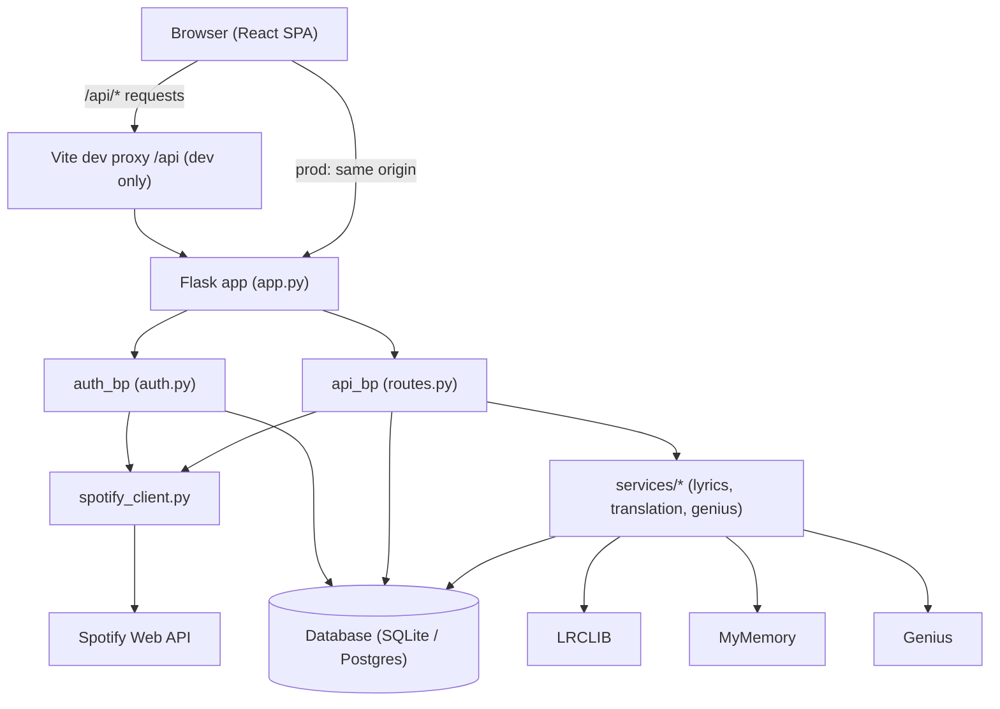
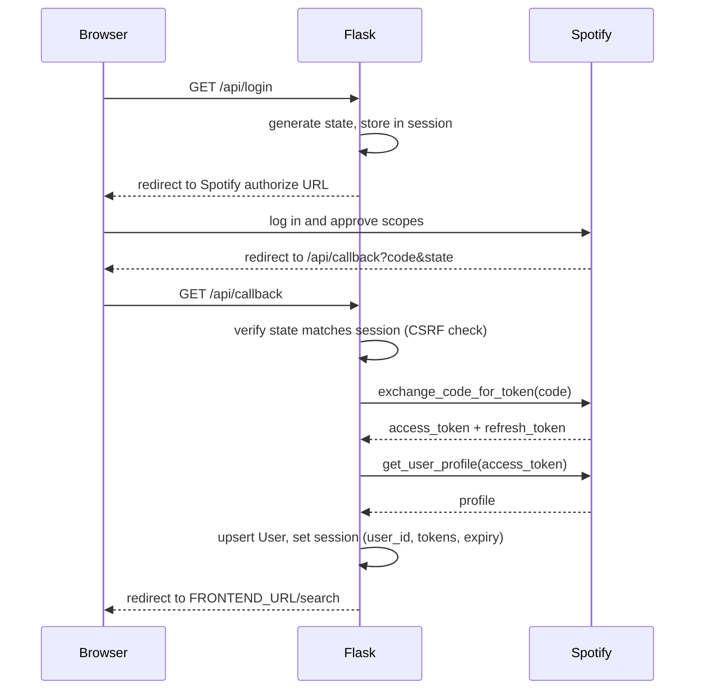
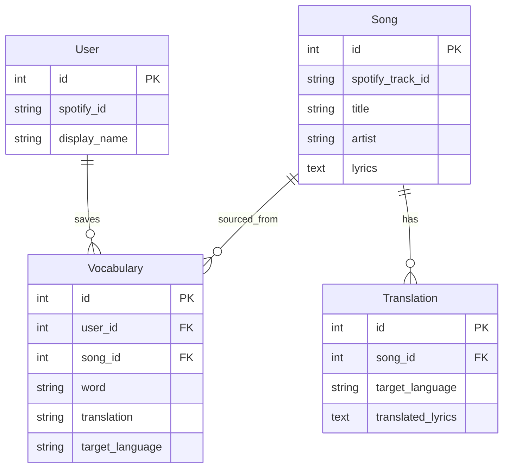

# Architecture

## Overview

Linguify helps you learn a language through music you already listen to. It connects to
your Spotify account, pulls lyrics for a track, translates them line by line, and lets you
save words to review later as flashcards. In production a single Flask service serves the
built React app and exposes the JSON API under `/api`.

## Directory Layout

- `backend/app.py` - Flask app factory: config, CORS, session cookies, blueprint
  registration, and the SPA fallback that returns `index.html` for client-side routes.
- `backend/auth.py` - Spotify OAuth blueprint (`/api/login`, `/api/callback`, `/api/me`,
  `/api/logout`) and session management.
- `backend/routes.py` - Main API blueprint (search, recently played, lyrics, translate,
  word translation, and vocabulary CRUD).
- `backend/spotify_client.py` - Thin wrapper around the Spotify Web API (auth URLs, token
  exchange/refresh, search, recently played, and track simplification).
- `backend/services/` - Business logic that talks to third-party APIs and the database:
  - `lyrics_service.py` - fetch/caches lyrics from LRCLIB.
  - `translation_service.py` - translates lyrics/words via MyMemory and caches results.
  - `genius_service.py` - looks up song metadata from Genius.
- `backend/models.py` - SQLAlchemy models: `User`, `Song`, `Translation`, `Vocabulary`.
- `backend/extensions.py` - shared SQLAlchemy `db` instance.
- `backend/tests/` - pytest suite (mocks external HTTP calls).
- `frontend/` - React + Vite single-page app (`src/pages`, `src/components`,
  `src/services/api.js`).

## Request / Data Flow

During development the Vite dev server proxies `/api` calls to Flask on port 5000. In
production Flask serves the built React bundle directly.

Notably, `_call_spotify` in [../backend/routes.py](../backend/routes.py) wraps Spotify
requests: if a call returns 400/401 (expired/invalid token) it refreshes the access token
once using the stored refresh token and retries.

## Spotify OAuth Flow

Implemented in [../backend/auth.py](../backend/auth.py). A random `state` value guards
against CSRF, and the session is populated only after the profile lookup succeeds.

## Data Model

Defined in [../backend/models.py](../backend/models.py):

- `User` - one row per Spotify account (`spotify_id` unique). Owns vocabulary words.
- `Song` - a track with optional `spotify_track_id` / `genius_id`, plus cached `lyrics`.
- `Translation` - a song's lyrics translated into a target language. A unique constraint
  (`unique_song_language_translation`) ensures one translation per song per language, so
  results can be cached and reused.
- `Vocabulary` - a saved word belonging to a user, optionally linked to the song it came
  from.

## External APIs

- **Spotify Web API** - OAuth login, track search, and recently played. Wrapped in
  `spotify_client.py`.
- **LRCLIB** - plain/synced lyrics, fetched and cached by `lyrics_service.py`.
- **MyMemory** - line-by-line and single-word translation via `translation_service.py`.
  Translations are limited to the first 30 lines per song to stay within API limits.
- **Genius** - song metadata via `genius_service.py`.

## Auth and Session Notes

- Session cookies are configured in [../backend/app.py](../backend/app.py) with
  `HttpOnly`, `SameSite` (default `Lax`), and `Secure` (enabled in production over HTTPS).
- The OAuth `state` parameter is validated on callback to prevent CSRF.
- API routes require an authenticated session; requests without one return `401`.
- `DELETE /api/words/<id>` filters by `user_id` so a user can only delete their own words,
  preventing insecure direct object reference (IDOR).
