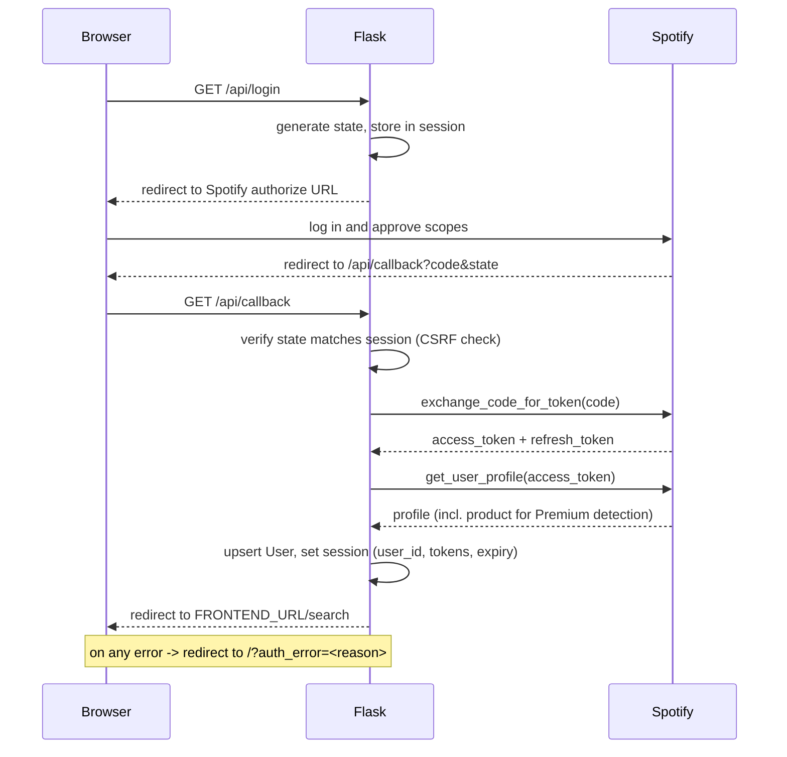
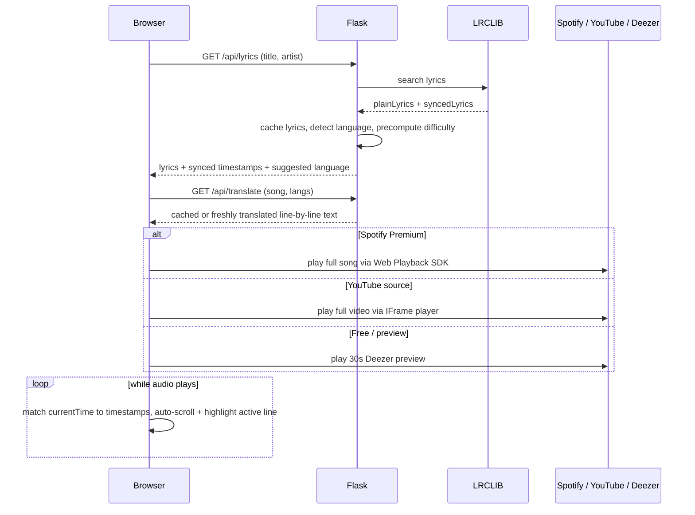
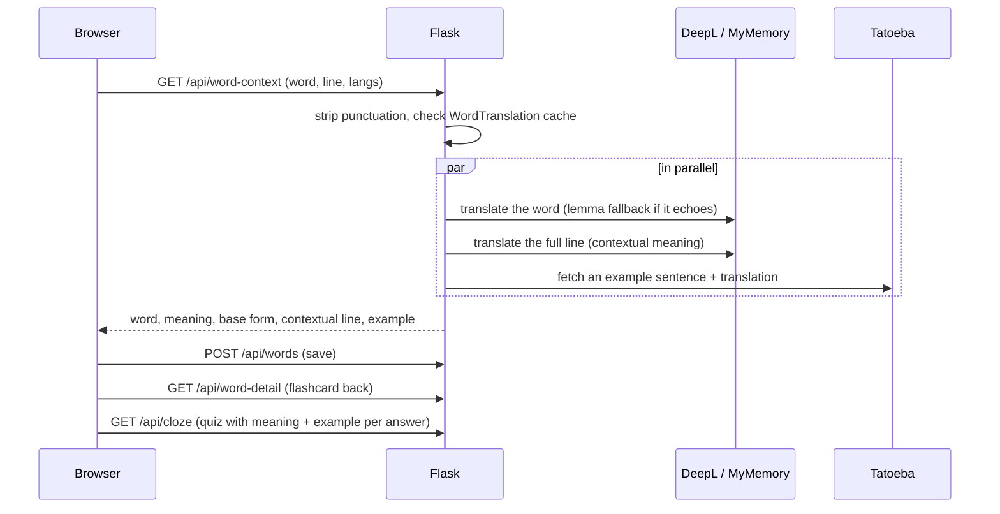
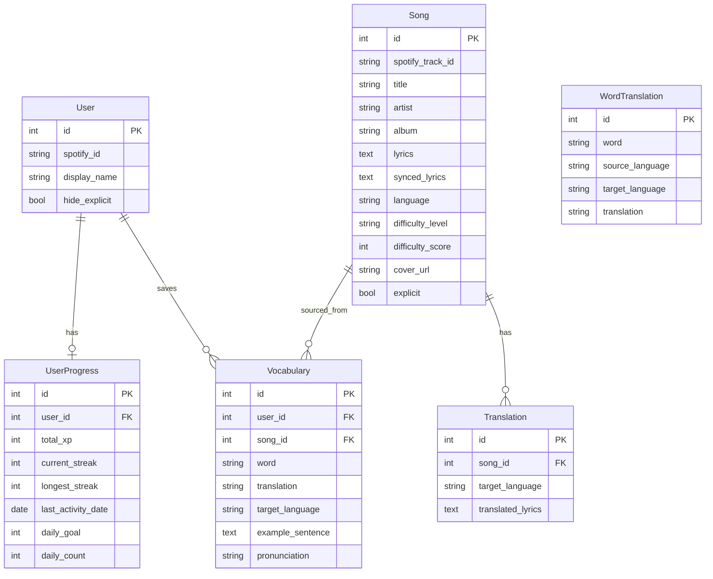

# Architecture

## Overview

Linguify helps you learn a language through music you already listen to. It connects to
your Spotify account (or lets you use YouTube instead), pulls lyrics for a track, translates
them line by line, and lets you save words to review later as flashcards. In production a
single Flask service serves the built React app and exposes the JSON API under `/api`.

Feature set:

- **Playback** - synced (karaoke) lyrics with in-app playback: a 30s preview for free users
  (via Deezer), the full song for Spotify Premium (via the Web Playback SDK), or the full
  song from YouTube (via the IFrame player) for people without Spotify.
- **Translation** - line-by-line lyric translation and tap-a-word lookups via DeepL
  (preferred) with an automatic MyMemory fallback, all cached in the database.
- **Word learning** - rich word cards with the meaning (shown in the language the lesson is
  taught in), the base/unconjugated form, a spoken pronunciation, and a real example sentence.
- **Flashcards & quizzes** - saved words become Quizlet-style flip flashcards; fill-in-the-blank
  (cloze) quizzes are generated from song lines with per-answer explanations.
- **Discovery** - a searchable catalog filterable by language and difficulty, plus an
  international "popular right now" shelf.
- **Progress & gamification** - XP, levels, daily streaks, and a daily words goal.
- **Language support** - automatic song-language detection, an expanded language list, and
  romanization/transliteration for non-Latin scripts.

## Directory Layout

- `backend/app.py` - Flask app factory: config, CORS, session cookies, SQLAlchemy engine
  options (connection resilience), blueprint registration, and the SPA fallback that returns
  `index.html` for client-side routes.
- `backend/auth.py` - Spotify OAuth blueprint (`/api/login`, `/api/callback`, `/api/me`,
  `/api/logout`). The callback validates the CSRF `state`, upserts the user, and on any error
  redirects back to the frontend with an `?auth_error=` reason instead of returning a 500.
- `backend/routes.py` - main API blueprint (search, playback, lyrics, translation, word
  lookups, vocabulary CRUD, discovery, quizzes, progress). `_call_spotify` transparently
  refreshes an expired token once and retries.
- `backend/spotify_client.py` - wrapper around the Spotify Web API (auth URLs, token
  exchange/refresh, search, recently played, playlists, playback scopes + Premium detection,
  track simplification).
- `backend/services/` - business logic that talks to third-party APIs and the database:
  - `lyrics_service.py` - fetches/caches lyrics from LRCLIB (plain + timestamped `synced_lyrics`),
    trying the primary artist and iterating results to skip entries with no lyrics.
  - `translation_service.py` - translates lyrics/words via DeepL batch requests (preferred) with
    a parallelized MyMemory fallback; caches per-song and per-word results, and re-tries word
    translations that previously just echoed the input, using the lemma as a fallback.
  - `language_service.py` - detects the song's language from its lyrics (`langdetect`).
  - `lemma_service.py` - reduces a word to its base/unconjugated form (`simplemma`).
  - `example_service.py` - fetches a real example sentence + translation for a word (Tatoeba).
  - `romanization_service.py` - transliterates non-Latin lyrics to Latin script (pypinyin,
    pykakasi, Unidecode fallback).
  - `difficulty_service.py` - scores how hard lyrics are from the share of rare words (`wordfreq`).
  - `cloze_service.py` - builds fill-in-the-blank quiz questions from song lines.
  - `discovery_service.py` - searches/filters the catalog by language and difficulty.
  - `song_stats_service.py` - precomputes and stores a song's language + difficulty for discovery.
  - `charts_service.py` - fetches and caches an international "popular" mix from Apple Music RSS
    (parallel, short-timeout, cached; display-only).
  - `deezer_service.py` - looks up a 30s preview and fallback cover art.
  - `youtube_service.py` - searches the YouTube Data API as an alternative music source.
  - `progress_service.py` - XP, levels, streaks, and daily-goal gamification.
- `backend/models.py` - SQLAlchemy models: `User`, `Song`, `Translation`, `WordTranslation`,
  `Vocabulary`, `UserProgress`.
- `backend/extensions.py` - shared SQLAlchemy `db` instance.
- `backend/gunicorn.conf.py` - production Gunicorn settings (extended timeout for the first
  uncached translation; disposes DB connections after each worker fork).
- `backend/tests/` - pytest suite (mocks external HTTP calls); run in CI via GitHub Actions
  alongside the frontend ESLint check.
- `frontend/` - React + Vite single-page app (`src/pages`, `src/components`,
  `src/services/api.js`, `src/data/languages.js`), plus the Spotify Web Playback SDK and
  YouTube IFrame player on the client, and the browser Web Speech API for pronunciation.

## Request / Data Flow

During development the Vite dev server proxies `/api` calls to Flask on port 5000. In
production Flask serves the built React bundle directly.

```mermaid
flowchart TD
    subgraph client [Client - React SPA]
        Browser["React app"]
        SpotifySDK["Spotify Web Playback SDK"]
        YouTubePlayer["YouTube IFrame Player"]
        WebSpeech["Web Speech API TTS"]
    end

    subgraph server [Flask backend]
        AuthBp["auth_bp"]
        ApiBp["api_bp"]
        SpotifyClient["spotify_client"]
        LyricsSvc["lyrics_service"]
        LangSvc["language_service (langdetect)"]
        LemmaSvc["lemma_service (simplemma)"]
        TransSvc["translation_service"]
        ExampleSvc["example_service"]
        RomanSvc["romanization_service"]
        DiffSvc["difficulty_service (wordfreq)"]
        ClozeSvc["cloze_service"]
        DiscoverySvc["discovery_service"]
        ChartsSvc["charts_service"]
        DeezerSvc["deezer_service"]
        YtSvc["youtube_service"]
        ProgressSvc["progress_service"]
    end

    DB[("DB: User, Song, Translation, WordTranslation, Vocabulary, UserProgress")]

    Spotify["Spotify Web API"]
    LRCLIB["LRCLIB - plain + synced lyrics"]
    DeepL["DeepL - translation (preferred)"]
    MyMemory["MyMemory - translation (fallback)"]
    Tatoeba["Tatoeba - example sentences"]
    Deezer["Deezer - 30s preview + cover"]
    Apple["Apple Music RSS - charts"]
    YouTube["YouTube Data API"]

    Browser --> AuthBp
    Browser --> ApiBp
    SpotifySDK -->|"full song (Premium)"| Spotify
    YouTubePlayer -->|"full song (YouTube)"| YouTube

    AuthBp --> SpotifyClient
    ApiBp --> SpotifyClient
    ApiBp --> LyricsSvc
    ApiBp --> LangSvc
    ApiBp --> TransSvc
    ApiBp --> ExampleSvc
    ApiBp --> RomanSvc
    ApiBp --> DiffSvc
    ApiBp --> ClozeSvc
    ApiBp --> DiscoverySvc
    ApiBp --> ChartsSvc
    ApiBp --> DeezerSvc
    ApiBp --> YtSvc
    ApiBp --> ProgressSvc

    SpotifyClient --> Spotify
    LyricsSvc --> LRCLIB
    TransSvc -->|"preferred"| DeepL
    TransSvc -->|"fallback"| MyMemory
    TransSvc --> LemmaSvc
    ExampleSvc --> Tatoeba
    ExampleSvc --> LemmaSvc
    ChartsSvc --> Apple
    DeezerSvc --> Deezer
    YtSvc --> YouTube

    AuthBp --> DB
    ApiBp --> DB
    LyricsSvc --> DB
    TransSvc --> DB
    DiscoverySvc --> DB
    ProgressSvc --> DB
```

## Spotify OAuth Flow

Implemented in [../backend/auth.py](../backend/auth.py). A random `state` value guards
against CSRF, and the session is populated only after the profile lookup succeeds. Any
failure (denied consent, bad state, Spotify error, or DB error) redirects to the landing
page with an `?auth_error=` reason so the user sees a friendly message instead of a 500.

## Synced Lyrics + Playback Flow

## Word Learning Flow

Tapping a word in the lyrics (or opening a flashcard) enriches it with a translated meaning,
its base form, and a real example sentence. Meanings are shown in the language the lesson is
taught in (the target language), so a Spanish->English lesson explains words in English.

## Data Model

Defined in [../backend/models.py](../backend/models.py):

- `User` - one row per Spotify account (`spotify_id` unique). Has a `hide_explicit`
  preference and owns vocabulary words and a progress row.
- `Song` - a track with an optional `spotify_track_id`, cached `lyrics` and timestamped
  `synced_lyrics`, plus precomputed discovery metadata (`language`, `difficulty_level`,
  `difficulty_score`, indexed), `album`, `cover_url`, and `explicit`.
- `Translation` - a song's lyrics translated into a target language, uniquely keyed by
  (`song_id`, `target_language`) so results are cached and reused.
- `WordTranslation` - a cache of single-word translations, uniquely keyed by
  (`word`, `source_language`, `target_language`).
- `Vocabulary` - a saved word belonging to a user, optionally linked to the source song.
  Stores the `translation`, `target_language`, an `example_sentence`, and `pronunciation`.
- `UserProgress` - per-user gamification: `total_xp`, `current_streak`, `longest_streak`,
  `last_activity_date`, and a `daily_goal` / `daily_count` for the day.

## External APIs & Libraries

- **Spotify Web API** - OAuth login, search, recently played, playlists, and full-song
  playback via the Web Playback SDK (Premium). Wrapped in `spotify_client.py`. Playback needs
  the `streaming`, `user-read-playback-state`, and `user-modify-playback-state` scopes;
  Premium is detected from the profile `product` field.
- **LRCLIB** - plain and synced (timestamped) lyrics, fetched and cached by `lyrics_service.py`.
- **DeepL** - preferred batch line and single-word translation (`DEEPL_API_KEY`). Higher
  quality, especially for slang and cross-family pairs.
- **MyMemory** - automatic translation fallback when DeepL is unavailable (no key, unsupported
  language, or quota). Line requests are parallelized and results cached to stay within limits.
- **Tatoeba** - keyless corpus used for real example sentences with translations
  (`example_service.py`).
- **Deezer** - 30s audio previews and fallback cover art (`deezer_service.py`).
- **Apple Music RSS** - keyless international top-song charts for the "popular" shelf
  (`charts_service.py`, display-only).
- **YouTube Data API** - alternative music source search (`YOUTUBE_API_KEY`,
  `youtube_service.py`), played with the YouTube IFrame player on the client.

Local (no network) libraries: `langdetect` (language detection), `wordfreq` (difficulty
scoring + quiz word selection), `simplemma` (lemmatization), and `pypinyin` / `pykakasi` /
`unidecode` (romanization). Client-side, the browser **Web Speech API** provides spoken
pronunciation of words (no backend or API key needed).

## Deployment & Resilience

Deployed on Render as a single web service (Flask + Gunicorn) backed by managed PostgreSQL;
locally it uses SQLite. Start command: `cd backend && gunicorn app:app` (which auto-loads
`gunicorn.conf.py`).

- **Worker timeout** - `gunicorn.conf.py` sets a 120s timeout so the first uncached full-song
  translation isn't killed mid-request (later loads are instant from the cache).
- **DB connection resilience** - `app.py` sets `pool_pre_ping` + `pool_recycle` so idle
  connections dropped by managed Postgres are detected and replaced; `gunicorn.conf.py`'s
  `post_fork` hook disposes connections inherited across a worker fork (which otherwise causes
  `SSL error: decryption failed or bad record mac` / `SSL SYSCALL error: EOF`).
- **External-call safety** - the international charts fetch runs all storefronts in parallel
  with a short per-request timeout and caches its result (even an empty one) to avoid retry
  storms; `/api/popular` is wrapped defensively so it can never crash a worker and takes the
  landing page down with it.

## Auth and Session Notes

- Session cookies are configured in [../backend/app.py](../backend/app.py) with `HttpOnly`,
  `SameSite` (default `Lax`), and `Secure` (enabled in production over HTTPS).
- The OAuth `state` parameter is validated on callback to prevent CSRF.
- API routes require an authenticated session; requests without one return `401`.
- `DELETE /api/words/<id>` and the bulk `DELETE /api/words` both filter by `user_id`, so a
  user can only delete their own words (prevents insecure direct object reference / IDOR).
- Playback uses expanded Spotify scopes (`streaming`, `user-read-playback-state`,
  `user-modify-playback-state`); keep all secrets in environment variables only.
