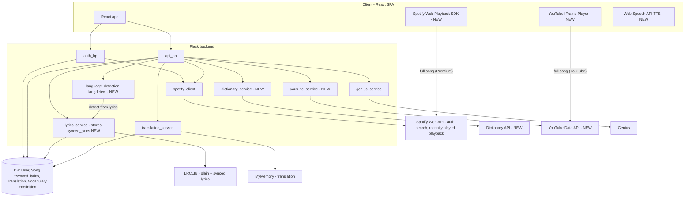
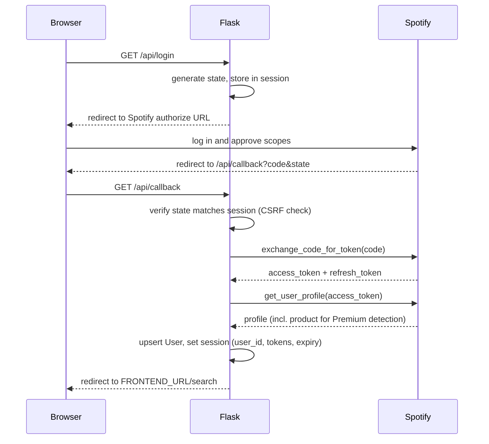
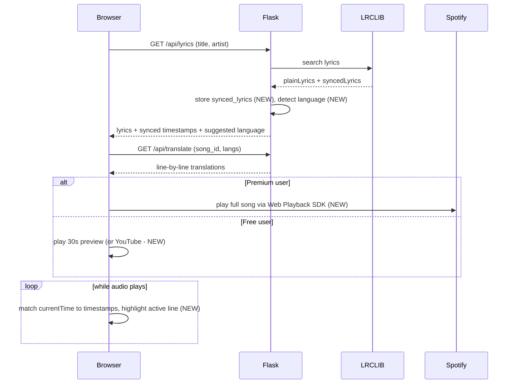
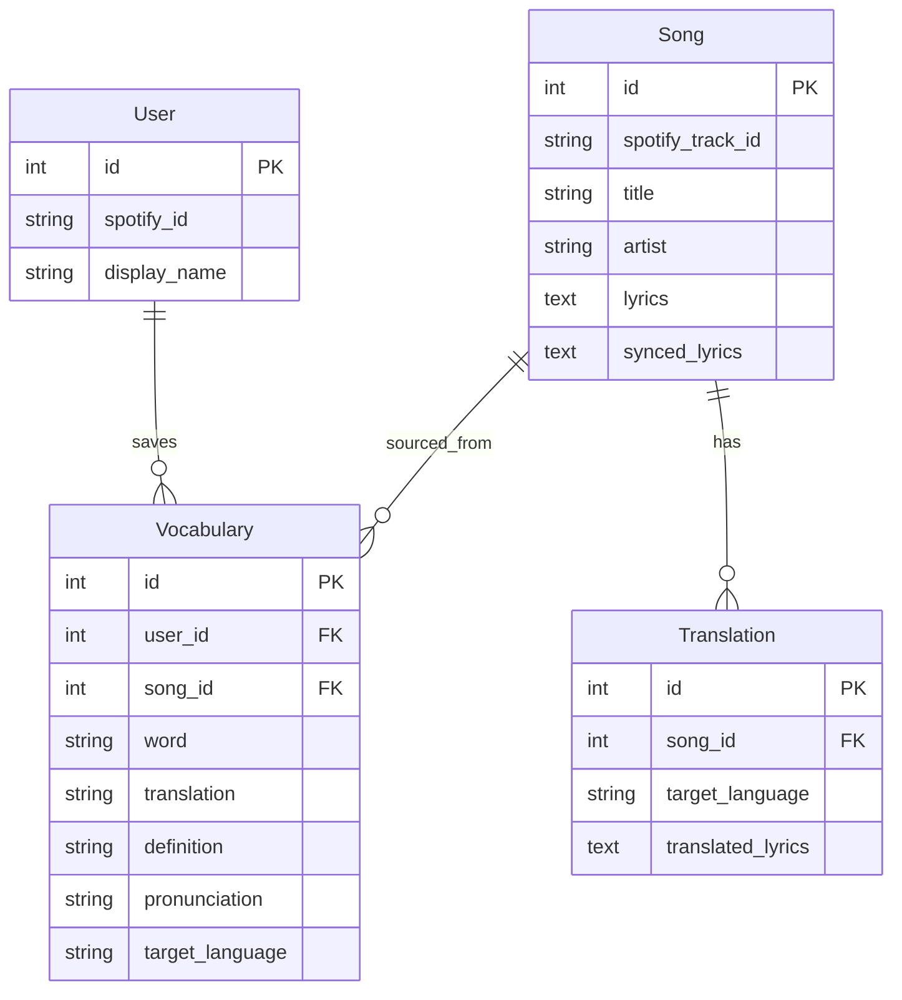

# Architecture

## Overview

Linguify helps you learn a language through music you already listen to. It connects to
your Spotify account, pulls lyrics for a track, translates them line by line, and lets you
save words to review later as flashcards. In production a single Flask service serves the
built React app and exposes the JSON API under `/api`.

Project 3 adds: synced (karaoke) lyrics with in-app playback (30s preview for free users,
full song for Spotify Premium via the Web Playback SDK), automatic song-language detection,
real dictionary definitions and spoken pronunciation on word cards, flash cards organized by
language, more supported languages, and an alternative music source (YouTube).

## Directory Layout

- `backend/app.py` - Flask app factory: config, CORS, session cookies, blueprint
  registration, and the SPA fallback that returns `index.html` for client-side routes.
- `backend/auth.py` - Spotify OAuth blueprint (`/api/login`, `/api/callback`, `/api/me`,
  `/api/logout`) and session management.
- `backend/routes.py` - Main API blueprint (search, recently played, lyrics, translate,
  word translation, and vocabulary CRUD).
- `backend/spotify_client.py` - Wrapper around the Spotify Web API (auth URLs, token
  exchange/refresh, search, recently played, playback scopes + Premium detection, track
  simplification).
- `backend/services/` - Business logic that talks to third-party APIs and the database:
  - `lyrics_service.py` - fetches/caches lyrics from LRCLIB, including timestamped
    `synced_lyrics`.
  - `translation_service.py` - translates lyrics/words via MyMemory and caches results.
  - `language_detection.py` - detects the song's language from its lyrics (langdetect).
  - `dictionary_service.py` - fetches real definitions from a dictionary API.
  - `youtube_service.py` - searches the YouTube Data API as an alternative music source.
  - `genius_service.py` - looks up song metadata from Genius.
- `backend/models.py` - SQLAlchemy models: `User`, `Song`, `Translation`, `Vocabulary`.
- `backend/extensions.py` - shared SQLAlchemy `db` instance.
- `backend/tests/` - pytest suite (mocks external HTTP calls); run in CI via GitHub Actions.
- `frontend/` - React + Vite single-page app (`src/pages`, `src/components`,
  `src/services/api.js`), plus the Spotify Web Playback SDK and YouTube IFrame player on the
  client, and the browser Web Speech API for pronunciation.

## Request / Data Flow

During development the Vite dev server proxies `/api` calls to Flask on port 5000. In
production Flask serves the built React bundle directly. (Items marked NEW are added in
Project 3.)



Notably, `_call_spotify` in [../backend/routes.py](../backend/routes.py) wraps Spotify
requests: if a call returns 400/401 (expired/invalid token) it refreshes the access token
once using the stored refresh token and retries.

## Spotify OAuth Flow

Implemented in [../backend/auth.py](../backend/auth.py). A random `state` value guards
against CSRF, and the session is populated only after the profile lookup succeeds.



## Synced Lyrics + Playback Flow (Project 3)



## Data Model

Defined in [../backend/models.py](../backend/models.py):

- `User` - one row per Spotify account (`spotify_id` unique). Owns vocabulary words.
- `Song` - a track with optional `spotify_track_id` / `genius_id`, plus cached `lyrics` and
  timestamped `synced_lyrics` (added in Project 3 for karaoke sync).
- `Translation` - a song's lyrics translated into a target language. A unique constraint
  (`unique_song_language_translation`) ensures one translation per song per language, so
  results can be cached and reused.
- `Vocabulary` - a saved word belonging to a user, optionally linked to the song it came
  from. Includes `definition` (real dictionary meaning, added in Project 3) and
  `pronunciation`.



## External APIs

- **Spotify Web API** - OAuth login, track search, recently played, and full-song playback
  via the Web Playback SDK (Premium). Wrapped in `spotify_client.py`. Playback needs the
  `streaming`, `user-read-playback-state`, and `user-modify-playback-state` scopes, and
  Premium is detected from the profile `product` field.
- **LRCLIB** - plain and synced (timestamped) lyrics, fetched and cached by
  `lyrics_service.py`.
- **MyMemory** - line-by-line and single-word translation via `translation_service.py`.
  Translations are limited to the first 30 lines per song to stay within API limits.
- **Dictionary API** (NEW) - real word definitions via `dictionary_service.py`.
- **YouTube Data API** (NEW) - alternative music source (search) via `youtube_service.py`,
  played with the YouTube IFrame player on the client.
- **Genius** - song metadata via `genius_service.py`.

Client-side, the browser **Web Speech API** provides spoken pronunciation of saved words
(no backend or API key needed).

## Auth and Session Notes

- Session cookies are configured in [../backend/app.py](../backend/app.py) with
  `HttpOnly`, `SameSite` (default `Lax`), and `Secure` (enabled in production over HTTPS).
- The OAuth `state` parameter is validated on callback to prevent CSRF.
- API routes require an authenticated session; requests without one return `401`.
- `DELETE /api/words/<id>` filters by `user_id` so a user can only delete their own words,
  preventing insecure direct object reference (IDOR).
- Playback uses expanded Spotify scopes (`streaming`, `user-read-playback-state`,
  `user-modify-playback-state`); keep all secrets in environment variables only.
```
